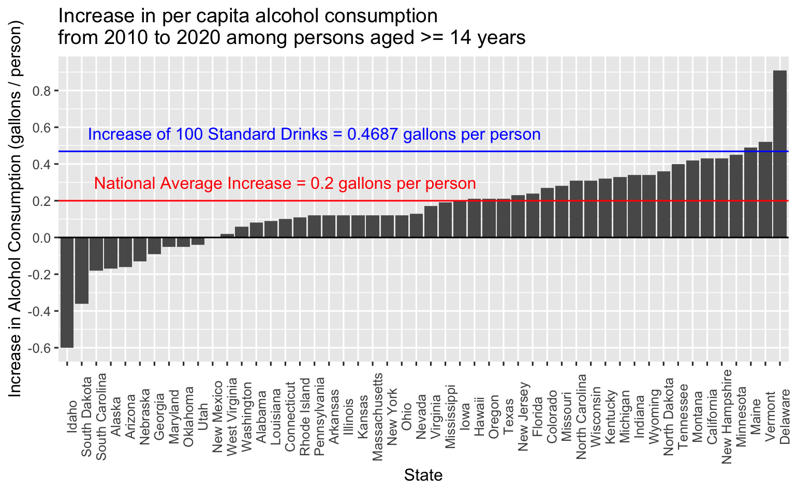
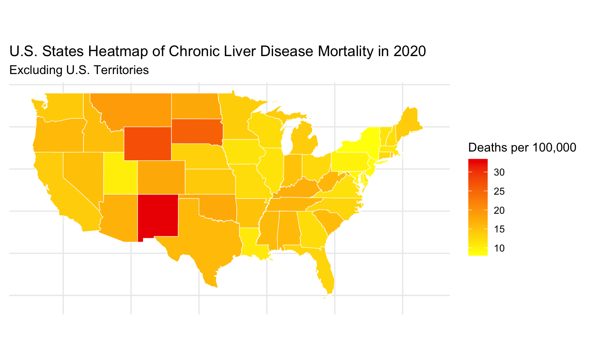
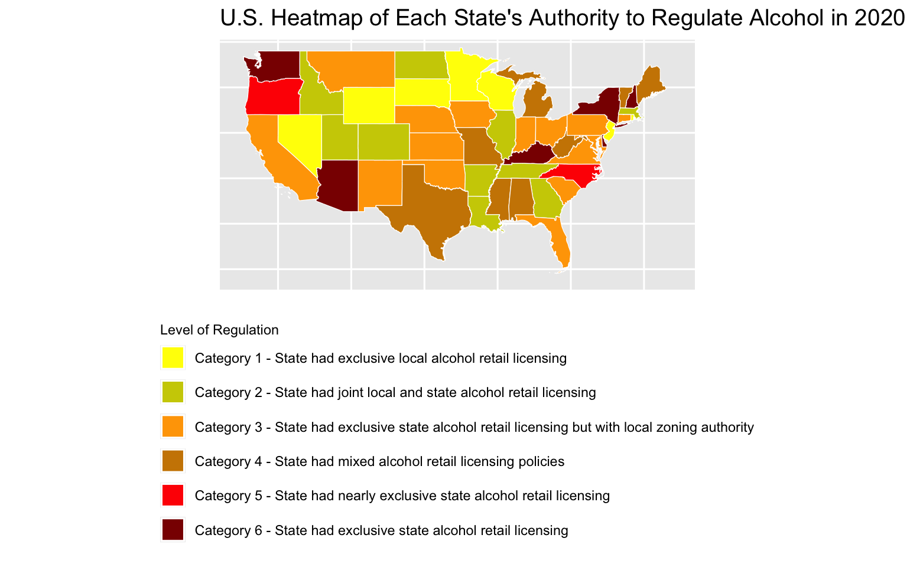

# STAT 451 Final Project

## Group Members:

**Vy Nguyen, Jennie Jeon, Minh Tran, Elvin Liu**

## Project Goal

For this project, we aim to explore trends in the chronic disease indicator of alcohol across various demographics, regions, and time periods in the United States.
In particular, we will hone in on how the prevalence of alcohol consumption fluctuates over time across states. We would like to know which states consume the most alcohol, have seen the greatest increases in alcohol consumption across the last few years, and have experienced high fatality rates due to alcohol abuse. The main research question guiding our work is then "how does alcohol consumption vary across states and what factors of consumption appear to be highly correlated?" By creating visual representations of these trends, we aim to not only highlight disparities across different states, but also assess the factors leading up to them. Most of the graphs will be "standard" such that they are easily interpretable and used to discern key public health anamolies (i.e. it is easy to identify outliers). This approach will allow us to capture critical trends and assess whether there are legitimate concerns for different states or if the country as a whole is trending towards more / less alcoholic behavior. Interactive elements can depict time and demographic comparisons extremely well.

The original dataset for this analysis was the "U.S. Chronic Disease Indicators, 2023 Release", which tracks 124 different health indicators across the United States, offering a comprehensive overview of each chronic disease metric. The link to the 350 mb csv file can be found [here](https://catalog.data.gov/dataset/u-s-chronic-disease-indicators-cdi).
The current dataset, the csv file under the name [alcohol_cdi.csv](https://github.com/LiuElvin/STAT_451_Final_Project/blob/main/alcohol_cdi.csv), is the result of filtering the "U.S. Chronic Disease Indicators, 2023 Release" dataset such that we only have data relating to alcohol. United States territories like Guam, Puerto Rico, Virgin Islands, etc. have also been removed. This way we can focus on statewide averages and the United States as a whole (also the maps will be easier to draw). It also reduces the size down to around 20 mb, allowing us to upload it onto GitHub. There are 16 unique questions regarding alcohol consumption in the dataset (e.g. alcohol during pregnancy, youth alcohol use, etc.), which is more than enough for our short analysis.

---

## Initial Project Goal

For this project, we aim to explore trends in chronic disease across various demographics and regions in the US, focusing on how specific health indicators -- both chronic disease symptoms and broader wellness metrics like physical and mental health —- are changing over the recent years. The main research question guiding our work is: How do chronic disease indicators, alongside other health metrics, vary across regions over time, and what factors might be driving these changes? By creating visual representations of these trends, we aim to not only highlight disparities across different regions but also assess the effectiveness of regional health initiatives. We plan to focus on indicators with significant fluctuations or connections to high mortality rates, as these could signal key public health issues. This approach will allow us to capture critical trends and assess whether current public health initiatives are successfully promoting overall health across communities.

The primary dataset for this analysis is the "U.S. Chronic Disease Indicators, 2023 Release", which tracks 124 health indicators across the United States, offering a comprehensive view of chronic disease metrics. This dataset includes data points from diverse state and federal agencies, allowing us to capture a wide array of regional trends. To contextualize changes in these indicators, we will examine major events that may influence health trends, such as the COVID-19 pandemic, which has had a substantial impact on both physical and mental health metrics. Since the dataset generally includes annual data points, we plan to highlight a few of these major events to see how they may have caused fluctuations in specific health indicators. In addition to this main dataset, we may incorporate data from other sources for a more detailed view of certain health metrics (e.g. depression statistics), however those are fairly available (especially for major problems like mental health). Some examples would be these links to data on [nutrition and physical activity](https://catalog.data.gov/dataset/nutrition-physical-activity-and-obesity-behavioral-risk-factor-surveillance-system) and the annual reports on [mental health and drug use](https://www.samhsa.gov/data/data-we-collect/nsduh-national-survey-drug-use-and-health). If we want to draw comparisons to worldwide trends, WHO also have a large dataset for each year at the link [here](https://data.who.int/). The main dataset is quite large (350 mb), so I've provided a link to the data [here](https://catalog.data.gov/dataset/u-s-chronic-disease-indicators-cdi).

## Graph 1

The answer this graph is answering is how much has alcohol consumption increased in each state from 2010 to 2020. As we can clearly see, on average the United States has increased alcohol consumption by 0.2 gallons per person. This is roughly equivalent to every person ages 14 and up drinking an extra 40 to 50 standard drinks per year - very substantial. Note that only 10 states have seen a decline in drinking over the 10 year period while drinking in Delaware has skyrocketed nearly quadruple the national average. Although there have been initiatives to reduce alcohol and drug usage, it appears there hasn't been any noticeable benefits, at least when we look at just how much alcohol consumption has increased in the timeframe inspected.

## Graph 2

How many mentally unhealthy days do Americans aged >= 18 experience, by race and ethnicity? By taking the average across all states by race and ethnicity, we can observe the average trend in the quality of mental health of an average American from 2011 to 2021. While there is a slight increase and decrease in the number of mentally unhealthy days, the overall trend is that Americans are experiencing more mentally unhealthy days over the last decade. It is also important to note that multiracial groups, on average, experience many more mentally unhealthy days than the specific ethnicities; this might be due to the nature of diversity in America. It is safe to assume that no matter the demographic, Americans are experiencing a decline in mental health. 

## Graph 3

  
  

The related graphs above address the question of "is there connection between state regulation of alcohol and liver disease mortality rate." From the graphs, we can see a fairly strong inverse correlation (higher regulated states usually have lower rates of liver disease mortality) however it isn't exactly 1 to 1. We can see certain states like Washington with the highest level of regulation and decent levels of liver disease deaths. On the flip side you also states like Wisconsin with extremely few regulations and a middling amount of deaths. There does appear to be some level of correlation, but it isn't a lot.
